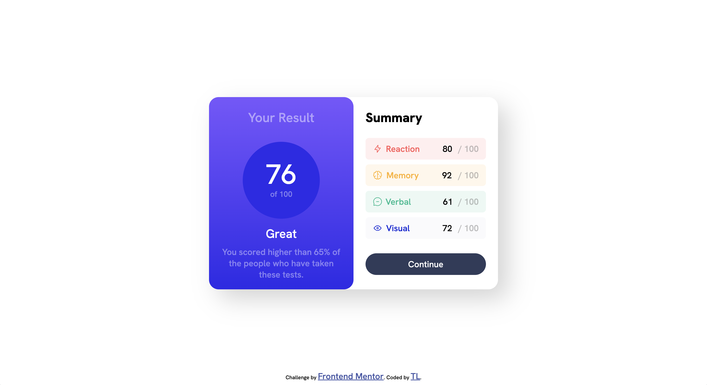

# Frontend Mentor - Results summary component solution

This is a solution to the [Results summary component challenge on Frontend Mentor](https://www.frontendmentor.io/challenges/results-summary-component-CE_K6s0maV). Frontend Mentor challenges help you improve your coding skills by building realistic projects. 

## Table of contents

- [Overview](#overview)
  - [The challenge](#the-challenge)
  - [Screenshot](#screenshot)
  - [Links](#links)
- [My process](#my-process)
  - [Built with](#built-with)
  - [What I learned](#what-i-learned)
  - [Continued development](#continued-development)
  - [Useful resources](#useful-resources)
- [Author](#author)
- [Acknowledgments](#acknowledgments)

## Overview

### Links

- Solution URL: [https://leafy-dragon-6677b9.netlify.app/](https://leafy-dragon-6677b9.netlify.app)

## My process

Started out with the main card that houses a right card, and a left card.

The left card will hold the score information.
- I've used three containers here

The right card will hold the summary of the score.
- I've used five unlisted list items
- I've used a button at the bottom

### Built with

- Semantic HTML5 markup
- CSS custom properties
- Flexbox

### What I learned

I've applied role attributes to the important divs. 

I've used DRY methods for my css. 

I'm getting better at parent - child relationships, and how containers should be configured so the children elements find their positions nicely. 

## Author
- Frontend Mentor - [@@wheels63](https://www.frontendmentor.io/profile/@wheels63)

## Acknowledgments

I'm a newbie and this is my third frontendmentor.io challenge. 

I feel very good about my progress. 

I will use this video resource to compare my code. 

https://www.youtube.com/watch?v=KqFAs5d3Yl8&t=44s&ab_channel=KevinPowell

Big ups to Kevin Powell for the great video. And big ups to Frontend Mentor IO as well. 